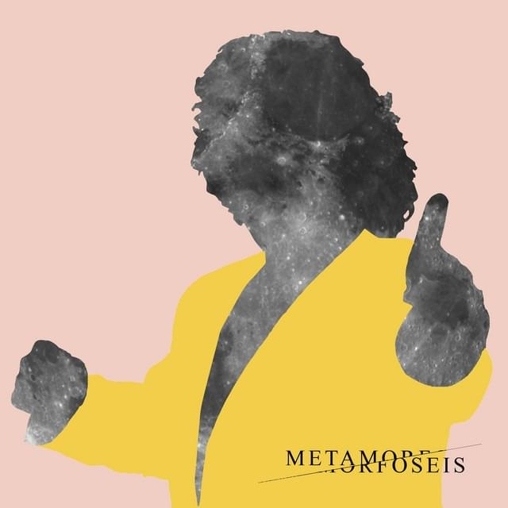
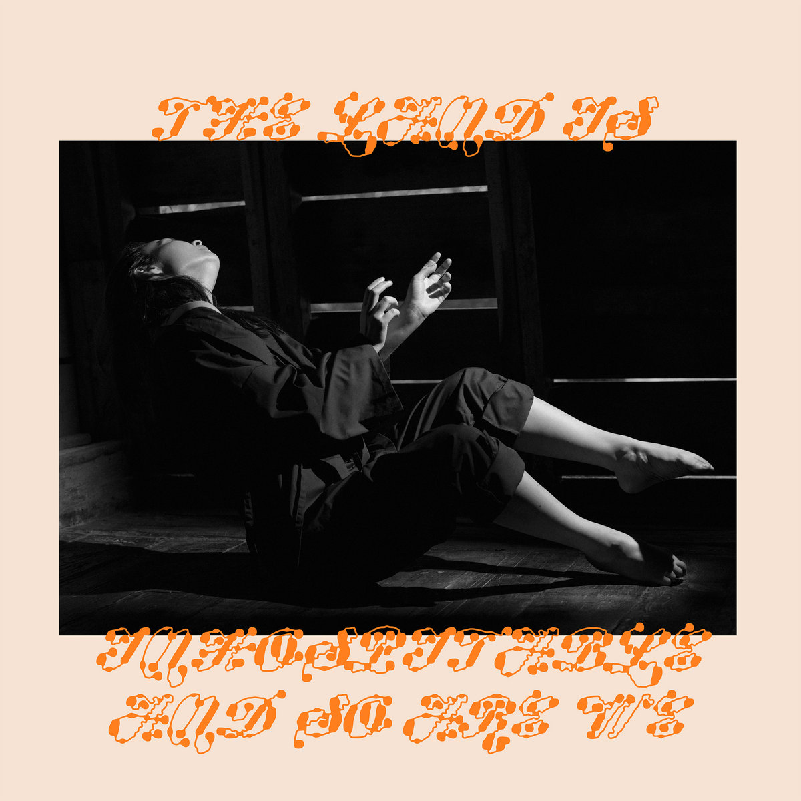
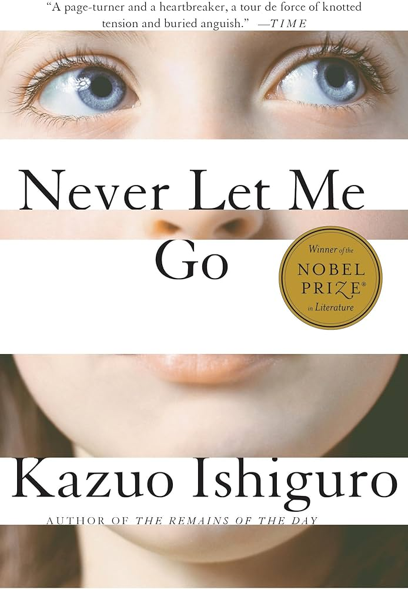
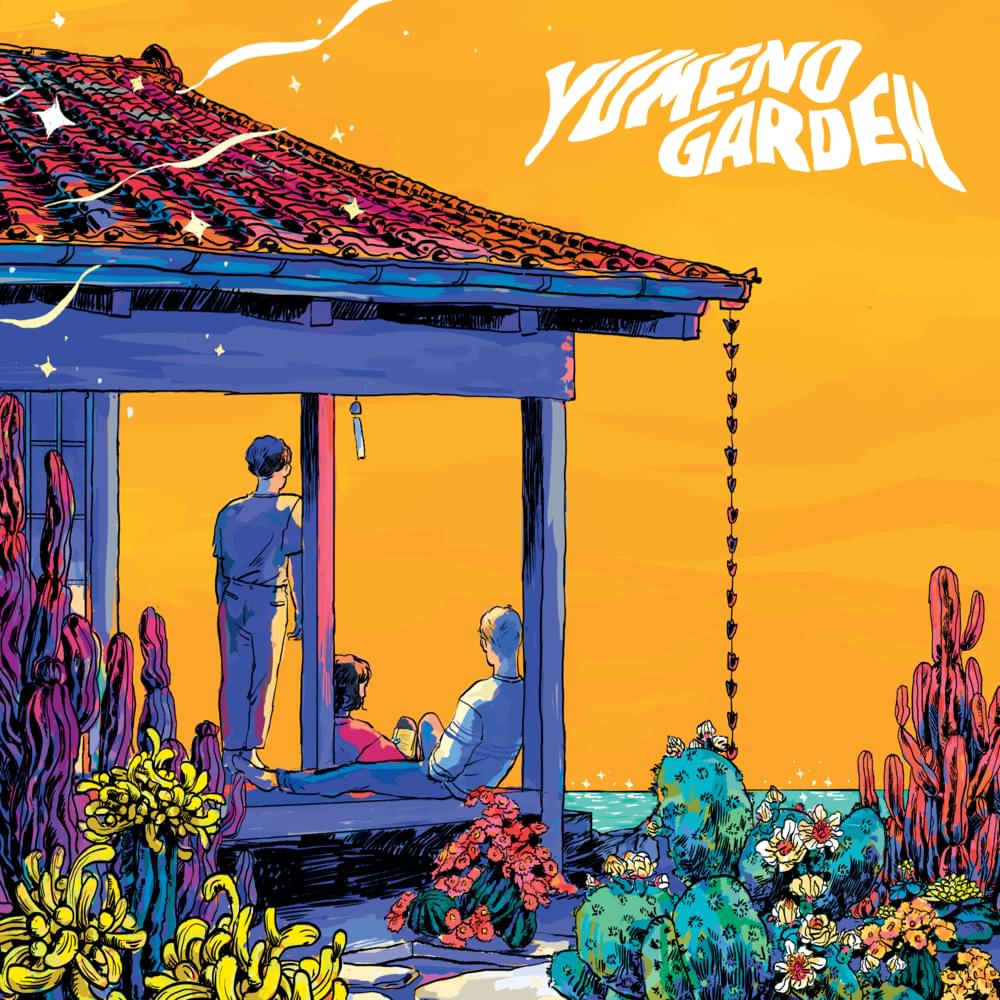
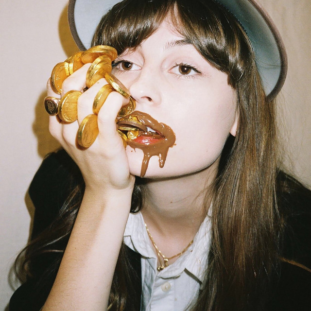
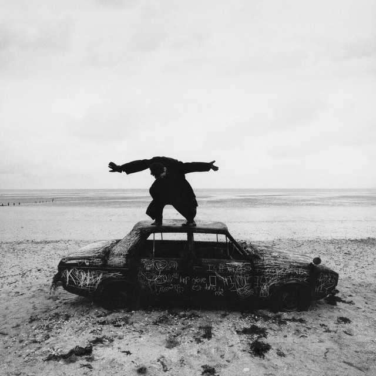
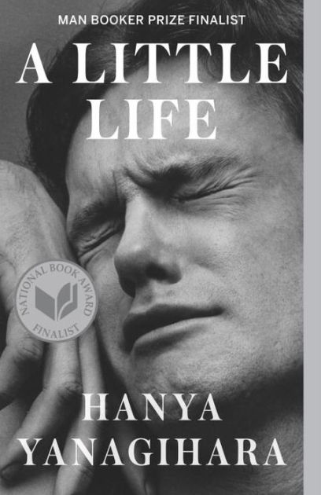
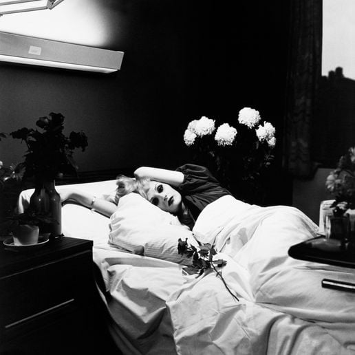

# ⚲ *Metamorfoseis* — Matina Sous Peau
*Music*

 
"I who change face and form in any minute I'll be gone." We can change so much that the self from a few years ago might hardly recognize the self of today. Metamorphosis is gradual, and it’s often hard to notice until you step back and see yourself from an outside angle. Yet at our core, we remain mostly the same. Our hearts still drawn to the same comforts, sometimes even the same people.

> Υπάρχεις μόνο εσύ δυο φίλοι κι η μουσική     
> *There is only you, a couple of friends and music*     
> που την καρδιά μου ξέρουν   
> *That understand my heart*

# ⚲ *My Love Mine All Mine* — Mitski
*Music*

 
The moon doesn’t belong to anyone, yet everyone feels a private claim to it. Lovers swear to it, lonely people confide in it, travelers use it to remember home. We’re comforted by the idea that the moon belongs to all of us, that across any distance or separation, we can all look up and find the same light in the night sky. Against the moon’s age, our lives seem so transient, but maybe that’s why we look up to it. If our hearts can’t last, perhaps the act of offering them can. 

> Here before and after me, shinin' down on me  
> Moon, tell me if I could send up my heart to you?   
> So when I die, which I must do  
> Could it shine down here with you?  

# ▷ *Loving Machine* — TV Girl
*Music*

 
AI love is quite sad. The beauty of human love lies in the fact that we fight to make things work. To forgive each other over and over, to accept someone with flaws whom you love anyway, because we’re all human. So to just be handed a commercial product tailored to your preferences? I’d hardly call that love, because you didn’t even try. But then again, how far can we delude ourselves into believing there’s no difference? If your lover is made of bolts and screws and mine of flesh and bone, what difference does it make if the feeling is the same? And maybe it's the corporation's fault for taking advantage of human's loneliness.

> When he gets obsolete  
> She can always just throw him away       
> And get a new one, but that's ok, she'll love him the same     
> As her fabulous loving machine     

# ▷ *Never Let Me Go* — Kazuo Ishiguro
*Science Fiction Novel*

 
This book holds a special place in my heart, as it was the first novel I studied in college. We’ll probably never return to a world before AI. It’s already transformed everything, and people are starting to lose the ability to think independently without its help. It makes me wonder if, we’re actually moving backward as a society, even as we claim technology defines how advanced we’ve become. What can we do now to keep ourselves from becoming the very dystopian society that literature has warned us about time and time again?

> How can you ask such a world to put away that cure, to go back to the dark days? There was no going back.      

# ▷ *The Theory of Everything*

*Movie*

 
A heart to care for the intellectual; a mind to nourish the carer. No single person can encapsulate everything, so we seek in others what we ourselves lack. And if one person cannot give us all we need, do we continue searching elsewhere? Or should we rewind our memories to a time when it felt like we already had everything? Eventually, the physical body will falter, some sooner than others, fighting against science and time. But maybe it is love that can transcend it all.

> "Wind back the clock..."  

# ▷ *Italo Disco* — Last Dinosaurs
*Music*

 

In my early teens, this was the song I listened to most. Now, hearing it again as a young adult, I’m hit with a deep sense of nostalgia. So much time has passed since my first listen, and the lyrics feel different now. I’ve crossed paths with many people- some who became my closest friends, others who remained strangers, and some who now exist only in memory. 

> And when I think   
> Of everything that we did together   
> Somewhere in Verona   
> The sun set over our time together   

# ▷ *Kingston* — Faye Webster
*Music*

 

Autumn is probably my favorite season, and this song always finds its way back into my playlist around that time. It’s especially nice to listen to after waking in the morning, still dazed from a dream, while the air outside is crisp and the leaves are turning every shade of red and orange. I can stay warm under my blankets. Maybe I'll have a warm cup of chai...

> It's the thought of you that slightly scares me   
> But it takes my breath away   
> Forget what I was gonna say   
> The day that I met you I started dreaming   
> Now I write 'em down if I remember in the morningtime  

# ▷ *About You* — The 1975
*Music*

The opening instrumental is a beautiful chaos, all the sounds of a symphony colliding at once. It reminds me of the concerts I used to go to with my dad at the Kennedy Center in D.C. I often play this song on the subway or during walks, and when I do, my mind drifts through people, places, voices, faces. These memories help pass the time.

> And there was something 'bout you that now I can't remember   
> It's the same damn thing that made my heart surrender    
> And I miss you on the train, I miss you in the morning    
> I never know what to think about    
> I think about you   

And, of course, I haven’t forgotten.

# ▷ *Saw You In A Dream* — Japanese House
*Music*

Dreams are a strange thing. You’re supposed to be at rest while you sleep, yet sometimes your mind feels more active than ever, spinning the wildest visions so vivid they can feel more real than waking life. That’s how some of my dreams are. I’ve lived through entire stories in my sleep, and a few have even left a mark on my waking world.

> I saw you in a dream   
> You came to me   
> You were the sweetest apparition, such a pretty vision     
> There was no reason, no explanation  
> The perfect hallucination  

# ▷ *A Little Life* — Hanya Yanagihara
*Fiction Novel*

I started reading this book in June 2024, and it took me a full year to finish all 814 pages. Looking back, I realize it was because I was savoring the story. I’ve always appreciated long books, since they let you follow a character’s entire life. There’s something beautiful about witnessing how much life shifts over time, so much that it feels as if you’ve lived multiple lifetimes within a single one. Yet even as everything changes, a few people remain with you through it all. And sometimes, that’s all you need.

> “Life rearranges itself to compensate for your loss, sometimes wonderfully.”

# ▷ *Man Is The Baby* — Antony
*Music*

The desolate voice of the singer spoke for itself. I first heard this song at *Le Crazy Horse de Paris*, never expecting something so heartbreaking in that setting. As I watched the dancer’s silhouette wilt with grace, I wondered whether it was the male gaze corroding a woman’s spirit, or if fragility and sorrow are inseparable from sensuality itself.

> Forgive me, let live me, set my spirit free   
> Weakness sown, overgrown     
> Man is the baby  
