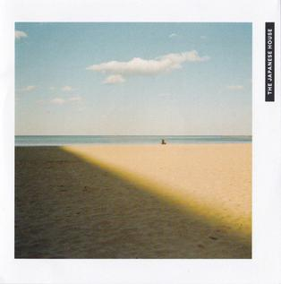

# ▷ *A Little Life* — Hanya Yanagihara
*Fiction Novel*

I started reading this book in June 2024, and it took me a full year to finish all 814 pages. Looking back, I realize it was because I was savoring the story. I’ve always appreciated long books, since they let you follow a character’s entire life. There’s something beautiful about witnessing how much life shifts over time, so much that it feels as if you’ve lived multiple lifetimes within a single one. Yet even as everything changes, a few people remain with you through it all. And sometimes, that’s all you need.

> “Life rearranges itself to compensate for your loss, sometimes wonderfully.”

# ▷ *Saw You In A Dream* — Japanese House
*Music*

Dreams are a strange thing. You’re supposed to be at rest while you sleep, yet sometimes your mind feels more active than ever, spinning the wildest visions so vivid they can feel more real than waking life. That’s how some of my dreams are. I’ve lived through entire stories in my sleep, and a few have even left a mark on my waking world.

> I saw you in a dream   
> You came to me   
> You were the sweetest apparition, such a pretty vision     
> There was no reason, no explanation  
> The perfect hallucination 

# ▷ *About You* — The 1975
*Music*

*And there was something 'bout you that now I can't remember*   
*It's the same damn thing that made my heart surrender*  
*And I miss you on the train, I miss you in the morning*  
*I never know what to think about*  
*I think about you*  