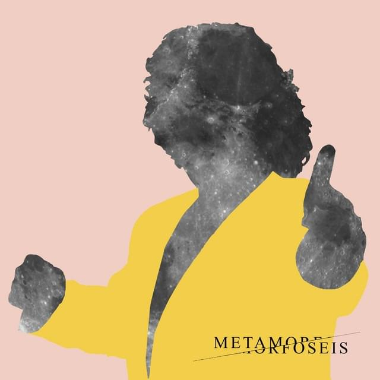
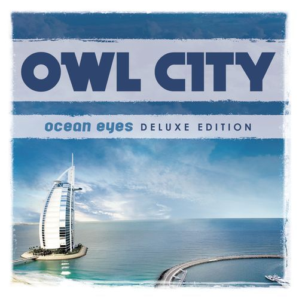
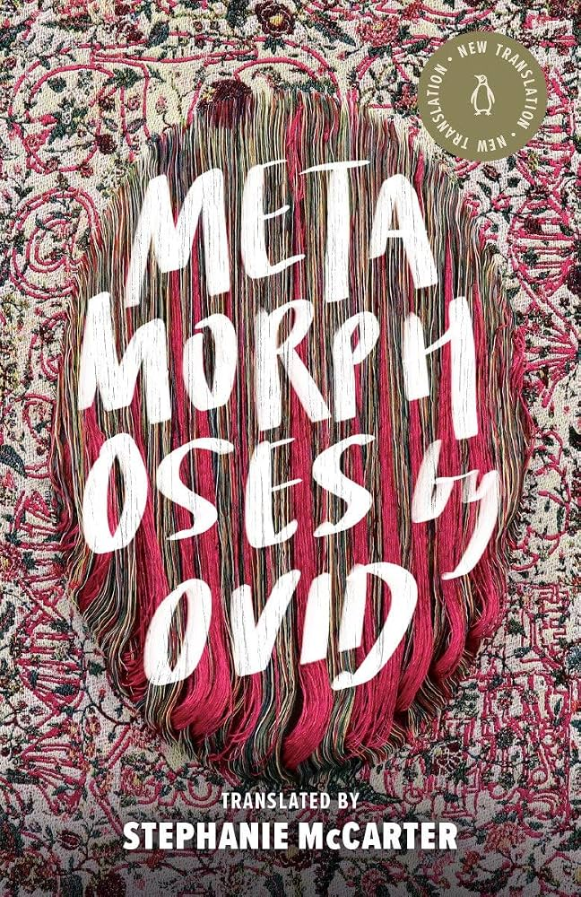
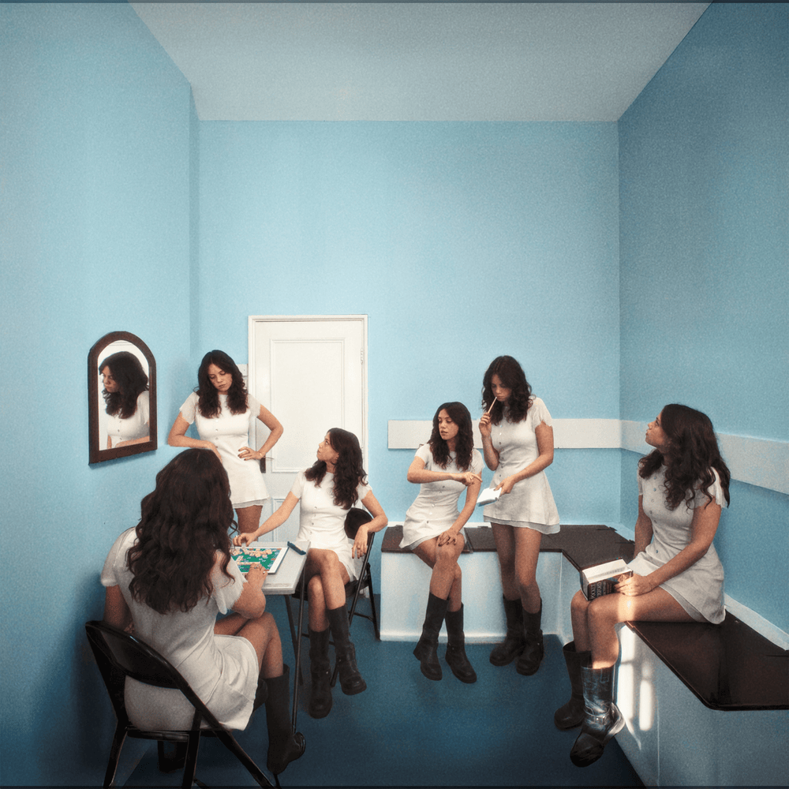
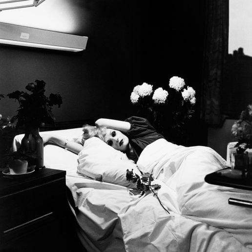
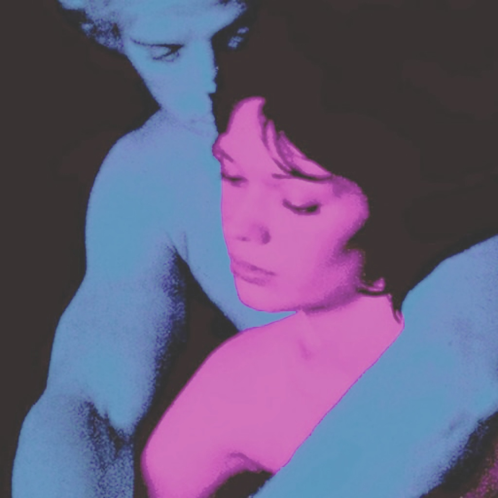
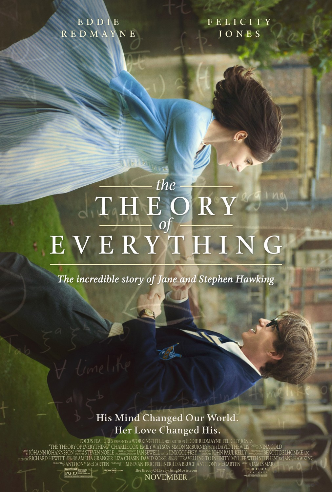
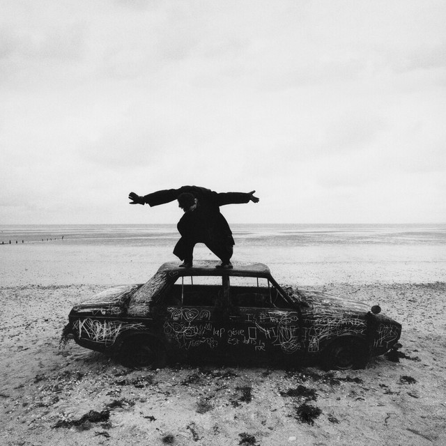
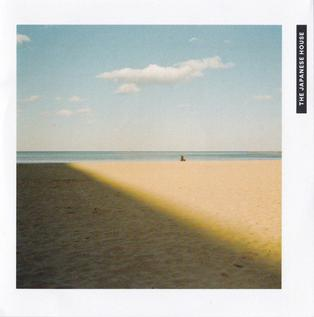

# ⚲ *Metamorfoseis* — Matina Sous Peau
*Music (Greek)*

 
"I who change face and form in any minute I'll be gone." We can change so much that the self from a few years ago might hardly recognize the self of today. Metamorphosis is gradual, and it’s often hard to notice until you step back and see yourself from an outside angle. Yet at our core, we remain mostly the same. Our hearts still drawn to the same comforts, sometimes even the same people.

> Υπάρχεις μόνο εσύ δυο φίλοι κι η μουσική     
> *There is only you, a couple of friends and music*     
> που την καρδιά μου ξέρουν   
> *That understand my heart*

# ▷ *The Saltwater Room* — Owl City
*Music*

 
Since childhood, this song has held a special place in my heart for its vague, dream-like quality. Even now, I struggle to offer a proper introduction to it, as I myself remain unsure of what it truly means to me. But imagine you're drifting through a saltwater room, a liminal space suspended between land and water, where nothing is one thing more than another. You cannot tell if what you're experiencing is dream or reality. Outside is flooded with tears or ocean, the salt water which represents sadness and chaotic uncertainty. But inside is the bubble where the two of you have built a fragile, temporary ecosystem, safe from the oddities of the world. 

> I opened my eyes last night and saw you in the low light      
> Walking down by the bay, on the shore   
> Staring up at the stars that aren't there anymore...   
> Time together is just never quite enough 

# ▷ *Metamorphoses by Ovid* — Echo & Narcissus
*Poem*

 
Echo was a nymph cursed to only repeat the last words spoken to her, and when she fell in love with Narcissus she could offer him nothing but an echo of himself. Although myth, this is in many ways what we do when we are enchanted to silence by the presence of someone we admire. We offer them themselves because in our eyes they embody perfection and we don't know what else to give. But when we wear the skin of someone who is not us the artifice becomes transparent and people recoil from it, they can sense it, the way Narcissus recoiled from Echo even though all she was doing was loving him the only way she knew how.

> "Come be with me!" he says.  
> Echo had never been more glad to echo and repeated,  
> "Be with me!"

# ▷ *Sogni Ancora* — Piero Piccioni
*Music (Italian)*

 
Under spells of dreams, we become like naïve does prancing through meadows. There, nothing can hurt us, and we are safe, un-surveillanced and unsupervised, for the dream world hardly infringes upon the real one. Faces of those we spend so much time thinking about in the daytime follow us when we retreat to that more vulnerable place at night. There, we are liberated to reconstruct happier exchanges, romanticized conversations, and our own ideal endings. So why revel in these comforts anyway, when by the morning light we rise again to a reality we cannot and dare not change? Dreams are a gift, our only opportunities to sneak peeks at our alternatives. Harmless ones, too! When we wake, the entire world dissolves like mist, and we are forever barred from ever returning to it, until we forget and it no longer belongs to our reality at all. 

> Sogni ancora, ma perché vuoi sognare     
> *You still dream, but why do you want to dream?*     
> Quando tu non vuoi cambiare La realtà?   
> *When you don't want to change Reality?*

# ▷ *Inventing* — Matilda Mann
*Music*

 
For some reason, this song reminds me of Barnard. :) One semester down, and I’ve already seen so many smart, beautiful, inspiring young women doing all sorts of incredible things. So loving, so creative, constantly inventing, tinkering, writing, designing. Always on the go, always improving. And what a gift it is to be surrounded by such contagious energy!

> Love is just too weak of a word  
> I've gotta get inventing, something's gotta hit it     

# ▷ *Man Is The Baby* — Antony
*Music*

Can I be forgiven? Can I start over? Where did it all go wrong? We carry so much shame for our mistakes, as if we should have known better all along. But it is, after all, our first time living. Even adults, at their core, are still children. Faults are inevitable, for we cannot always see what lies ahead. We expect ourselves to move through life like experts, when in truth we are all beginners. Like infants, we reach for things we don’t understand and cry out when the world overwhelms us. We dress ourselves in confidence and call it maturity, but beneath it we are still tender, still afraid, still learning how to move forward without falling.

> Forgive me, let live me, set my spirit free   
> Weakness sown, overgrown     
> Man is the baby  

# ▷ *Loving Machine* — TV Girl
*Music*

 
AI love is quite sad. The beauty of human love lies in the fact that we fight to make things work. To forgive each other over and over, to accept someone with flaws whom you love anyway, because we’re all human. So to just be handed a commercial product tailored to your preferences? I’d hardly call that love, because you didn’t even try. But then again, how far can we delude ourselves into believing there’s no difference? If your lover is made of bolts and screws and mine of flesh and bone, what difference does it make if the feeling is the same? Regardless, it must be the corporation's fault for taking advantage of human's loneliness.

> When he gets obsolete  
> She can always just throw him away       
> And get a new one, but that's ok, she'll love him the same     
> As her fabulous loving machine     

# ▷ *The Theory of Everything*

*Movie*

 
A heart to care for the intellectual; a mind to nourish the carer. No single person can encapsulate everything, so we seek in others what we ourselves lack. And if one person cannot give us all we need, do we continue searching elsewhere? Or should we rewind our memories to a time when it felt like we already had everything? Eventually, the physical body will falter, some sooner than others, fighting against science and time. But maybe it is love that can transcend it all.

> "Wind back the clock..."  

# ▷ *Italo Disco* — Last Dinosaurs
*Music*

 

In my early teens, this was the song I listened to most. Now, hearing it again as a young adult, I’m hit with a deep sense of nostalgia. So much time has passed since my first listen, and the lyrics feel different now. I’ve crossed paths with many people- some who became my closest friends, others who remained strangers, and some who now exist only in memory. 

> And when I think   
> Of everything that we did together   
> Somewhere in Verona   
> The sun set over our time together   

# ▷ *About You* — The 1975
*Music*

The opening instrumental is a beautiful chaos, all the sounds of a symphony colliding at once. It reminds me of the many concerts I used to attend with my dad at the Kennedy Center in D.C., the murky sound of instruments tuning before the music began, before the symphony carried you into another world. I often play this song on the subway or during walks, and when I do, my mind drifts through people, places, voices, faces. Memories resurface as I travel through vistas. These memories help pass the time.

> And there was something 'bout you that now I can't remember   
> It's the same damn thing that made my heart surrender    
> And I miss you on the train, I miss you in the morning    
> I never know what to think about    
> I think about you   

# ▷ *Saw You In A Dream* — Japanese House
*Music*

Dreams are a strange thing. You’re supposed to be at rest while you sleep, yet sometimes your mind feels more active than ever, spinning the wildest visions so vivid they can feel more real than waking life. That’s how some of my dreams are. I’ve lived through entire stories in my sleep, and a few have even left a mark on my waking world. 

> I saw you in a dream   
> You came to me   
> You were the sweetest apparition, such a pretty vision     
> There was no reason, no explanation  
> The perfect hallucination  

# ▷ *A Little Life* — Hanya Yanagihara
*Fiction Novel*

I started reading this book in June 2024, and it took me a full year to finish all 814 pages. Looking back, I realize it was because I was savoring the story. I’ve always appreciated long books, since they let you follow a character’s entire life. There’s something beautiful about witnessing how much life shifts over time, so much that it feels as if you’ve lived multiple lifetimes within a single one. Yet even as everything changes, a few people remain with you through it all. And sometimes, that’s all you need.

> “Life rearranges itself to compensate for your loss, sometimes wonderfully.”

